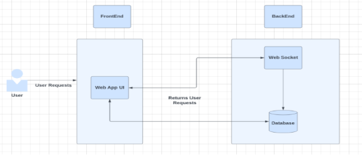
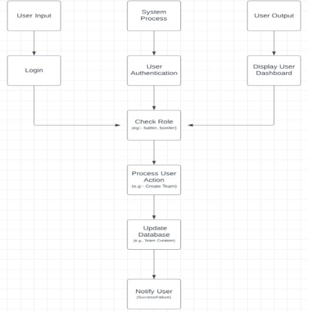
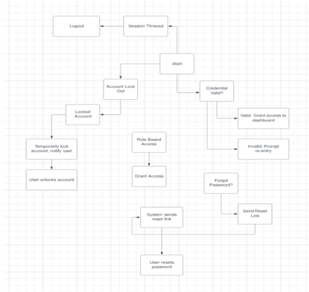

# CA326 Functional Requirements Document

## Project: ProCric

**Abdul Khan 21300866  
Faizan Ali Shah 21312345**

## Table of Contents

- [Introduction](#introduction)
  - [Purpose](#purpose)
  - [Document Conventions](#document-conventions)
  - [Glossary](#glossary)
  - [Intended Audience and Reading Suggestions](#intended-audience-and-reading-suggestions)
  - [Product Scope](#product-scope)
  - [References](#references)
  
- [Overall Description](#overall-description)
  - [Product Perspective](#product-perspective)
  - [Product Functions](#product-functions)
  - [User Classes and Characteristics](#user-classes-and-characteristics)
  - [Operating Environment](#operating-environment)
  - [Design and Implementation Constraints](#design-and-implementation-constraints)
  - [User Documentation](#user-documentation)
  - [Assumptions and Dependencies](#assumptions-and-dependencies)

- [External Interface Requirements](#external-interface-requirements)
  - [User Interfaces](#user-interfaces)
  - [Hardware Interfaces](#hardware-interfaces)
  - [Software Interfaces](#software-interfaces)
  - [Communications Interfaces](#communications-interfaces)

- [System Features](#system-features)
  - [System Feature 1: Secure User Authentication](#system-feature-1)
  - [System Feature 2: Scoring](#system-feature-2)
  - [System Feature 3: Team Creation](#system-feature-3)
  - [System Feature 4: Statistics Tracking](#system-feature-4)
  - [System Feature 5: Tournament Creation](#system-feature-5)
  - [System Feature 6: Flexibility](#system-feature-6)
  - [System Feature 7: Live Scoring](#system-feature-7)

- [Other Nonfunctional Requirements](#other-nonfunctional-requirements)
  - [Performance Requirements](#performance-requirements)
  - [Security Requirements](#security-requirements)
  - [Business Rules](#business-rules)

## Revision History

| Name | Date | Reason For Changes | Version |
|------|------|---------------------|---------|
| Abdul Khan | [Date] | [Reason] | [Version] |

## Introduction

### Purpose

ProCric is an “all in one” cricket management website that can be used to manage players, teams, matches and cricket tournaments.
The purpose of this program is to simplify the management of a cricket season, move from the pen and paper method of recording teams and record statistics of their own players.
The target audience of this program is from anyone who plays cricket to cricket team captains who will leverage the data gathering of the program to choose the best performing players for their teams.

Players will be able to create their own secure login on the ProCric website 

While there are many other applications on the web that perform these tasks, there is one large unique feature that our program will have that others do not, that is the ability to host matches and tournaments with indoor cricket rules rather than outdoor cricket rules.

Another unique feature of our program is the ability for users to modify tournament stages to their liking and the ability to select from a range of flexible rules that will suit a wide range of needs for cricketers.

The features that will be available in ProCric in detail are included later in this document.

### Document Conventions

In creating this Software Requirements Specification (SRS) for ProCric, we adhered to established document conventions to ensure consistency and clarity. 
The document follows a standardized font, utilizing Arial throughout, for improved readability. Headings and subheadings are highlighted using bold formatting, creating a clear hierarchy of information. 
This ensures that the importance of each requirement is easily discernible. The document employs a numbering system to uniquely identify each requirement, facilitating easy reference and traceability.

## Glossary

| Term      | Definition                                                                                  |
|-----------|-----------------------------------------------------------------------------------------------|
| Batter    | The player who hits the ball being thrown at him/her.                                       |
| Bowler    | The player who throws the ball at the batter.                                                |
| Fielder   | The player whose goal is to prevent the ball that was hit going to the boundary.             |
| Boundary  | A large circle around the cricket pitch, if the ball goes out of this circle, the batter gains 4 or 6 runs. |
| Runs      | The amount of “points” a team has obtained. Obtained by the batter.                           |
| Over      | Typically a bowler bowls 6 balls in an over. Cricket games can have 10, 20, or 50 overs per team inning in a game. |
| Inning    | The team that is currently batting.                                                          |
| Git       | An open source tool for version control system and source code management that keeps track of the changes happening in the code history. |
| Gitlab    | A code hosting platform that uses Git to store the code that people pushed and allows them to collaborate with others on projects from around the world. |
| Django    | Full stack website framework based in Python.                                                |
| ReactJS   | Open source front-end application written in JavaScript.                                     |
| Apache    | Open source software used to deploy websites.                                                |

### Intended Audience and Reading Suggestions
Developers will find technical specifications, project managers gain insights into project scope, marketing staff understand product features, and users preview functionalities. Testers can utilize detailed test cases, while documentation writers reference it for user manuals. 

The document is organized systematically, starting with an overview and progressing to functional and nonfunctional requirements, system interfaces, and dependencies. The suggested reading sequence begins with the overview, followed by a focus on functional requirements for developers, functional and non-functional requirements for project managers, user-centric details for marketing staff, and test cases for testers.

### Product Scope

ProCric is a cricket management platform designed to digitize the administration of cricket seasons. With its unique and customizable features and integration, this web-based program's goal is to replace the reliance on traditional pen-and-paper methods, presenting team captains with a centralized hub to oversee players, teams, matches, and entire cricket tournaments.

ProCric is digitizing and automating various methods of cricket management. One of its goals is to streamline the web of cricket-related data, offering captains an efficient means to organize and access information. This not only enhances the overall efficiency of cricket season management but also contributes significantly to the accuracy of the data.

The software facilitates the management of teams and players. ProCric gives the power to team captains by providing them with comprehensive tools to effortlessly oversee player rosters, team compositions, and other aspects of team performance. This not only simplifies team management but also ensures that captains can make informed decisions, ultimately focusing on creating the most competitive team possible and identifying weaknesses.

Furthermore, ProCric automates the recording of match statistics. This feature not only speeds up the time-consuming process of manual scorekeeping but also increases the accuracy of recorded data as less mistakes can be made digitally and readers will not misread scores.

As ProCric optimizes cricket administration processes, it promotes accessibility and user-friendliness for captains and other stakeholders involved in cricket management. The program eliminates the need for paperwork, offering an interface that simplifies tasks. This not only saves time but also money buying countless scoring books that are prone to being damaged over time or being lost, unlike data that is digitally stored.

## Overall Description

### Product Perspective

ProCric exists as a standalone cricket management website, serving as a new and self-contained product rather than a follow-on member of a product family or a replacement for existing systems. The software is designed to address the shortcomings of traditional, manual methods of managing cricket-related data, providing an all-encompassing solution for captains to efficiently handle players, teams, matches, and tournaments. ProCric is not defined as a component of a larger system but rather as an independent platform dedicated to cricket season management. Its context lies within the realm of sports administration, specifically cricket, aiming to streamline and enhance the processes associated with team and player management, as well as statistical record-keeping.

### Product Functions

#### User and Team Management:

- Register and manage user accounts.
- Create and manage cricket teams, including player roster information.

#### Match and Tournament Organization:

- Schedule, record, and manage cricket matches.
- Organize and administer cricket tournaments.

#### Statistical Tracking:

- Capture and store match statistics, including player performance data.
- Generate reports on individual and team performance.

#### Communication and Notifications:

- Facilitate communication between captains, players, and stakeholders.
- Send notifications for upcoming matches, events, or important announcements.

#### User Interface and Experience:

- Provide an intuitive and user-friendly interface for easy navigation.
- Ensure responsive design for accessibility on various devices.

#### Security and Access Control:

- Implement secure user authentication and authorization mechanisms.
- Define roles and permissions to control access to different features.

#### Data Backup and Recovery:

- Implement data backup procedures to prevent data loss.
- Enable data recovery in case of system failures.

### System Architecture

**Please see PDF version for image**

### Operating Enviroment

#### Hardware Platform
- ProCric is designed to operate on standard web servers with moderate to low processing power and storage capacity.
- It is accessible via common computing devices such as desktop computers, laptops, tablets, and smartphones.
- The system should be responsive on devices with varying screen sizes and resolutions.

#### Operating System and Versions
- The web application is compatible with multiple operating systems, including but not limited to:
  - Windows (versions: 7, 8, 10)
  - macOS
  - Linux distributions (e.g., Ubuntu, CentOS)

#### Web Browsers
- ProCric supports popular web browsers to ensure widespread accessibility:
  - Google Chrome (latest version)
  - Mozilla Firefox (latest version)
  - Microsoft Edge (latest version)
  - Safari (latest version)

#### Software Components
- ProCric relies on standard web technologies and frameworks, such as:
  - Web servers (Apache)
  - Database management systems (SQLite3)
  - Backend server-side scripting (e.g., Node.js, Django)
  - Frontend client-side scripting (e.g., HTML5, CSS3, JavaScript, ReactJS)

#### Internet Connectivity
- ProCric requires a stable internet connection for real-time updates, communication, and data synchronization.
- Offline functionality may be limited, and certain features may require an active connection.

#### Security Considerations
- ProCric employs encryption protocols (HTTPS) to ensure secure data transmission.
- Access controls and authentication mechanisms are implemented to protect user data and system integrity.

#### Environmental Constraints
- The application is designed to operate in various environments, but optimal performance is expected in environments with consistent internet connectivity and standard hardware configurations.

### Design and Implementation Constraints

We must adhere to hardware limitations, considering potential constraints in processing power and memory on Lab & personal machines. 
The system interfaces with external applications, requiring seamless integration and compliance with specified technologies such as Node.js, MySQL, and Django. 
Security is paramount, mandating the use of secure communication protocols and secure account information.

### User Documentation
ProCric will be accompanied with  user documentation components to facilitate effective usage with the software. Comprehensive user manuals will be provided, offering detailed guidance for captains, players, administrators, and other stakeholders. These manuals will feature step-by-step instructions, accompanied by screenshots and best practices. Interactive tutorials, including video demonstrations and hands-on exercises, will be developed to aid users in quickly grasping key functionalities.Documentation will be delivered in electronic formats accessible through the ProCric website and PDF versions.

### Assumptions and Dependancies

#### Development Environment
- The availability and functionality of development tools and frameworks (e.g., Node.js, Django) will remain consistent throughout the project. Changes in tool versions or compatibility could affect development timelines.

#### User Internet Connectivity
- Users will have a stable internet connection to access ProCric's real-time features. The project's success depends on users having consistent connectivity during critical operations.

#### Hardware Compatibility
- ProCric will be compatible with a range of devices. Changes in hardware technology or unexpected limitations may affect the performance and accessibility of the software.

##### Dependencies for ProCric
1. **Database Management System:**
   - The project is dependent on the stability and compatibility of the chosen database management system (e.g., MySQL). Changes in the database system may require adjustments to the software.

2. **Web Browsers:**
   - ProCric's functionality is tied to the compatibility of popular web browsers (e.g., Chrome, Firefox). Changes in browser behavior may necessitate updates to ensure a seamless user experience.

3. **Security Standards:**
   - The project is dependent on adherence to security standards mentioned in this document such as the usage of HTTPS.

4. **User Acceptance Testing:**
   - Dependency: The project schedule includes user acceptance testing. Delays or changes in the testing process may impact the overall project timeline.

## External Interface Requirements

### User Interface

**Please see PDF for image**

### Hardware Interfaces

- **Supported Devices:**
  - ProCric is accessible on desktops, laptops, tablets, and smartphones.

- **Screen Adaptability:**
  - Responsive design ensures optimal viewing on various screen sizes and resolutions.

- **Processing and Storage:**
  - Designed for standard web servers with moderate-low processing and storage capabilities.

- **Internet Connectivity:**
  - Stable internet connection required for real-time updates and critical operations.

- **Web Browsers:**
  - Supports popular browsers, including Chrome, Firefox, Edge, and Safari.

- **Software Components:**
  - Relies on standard web technologies, databases (e.g., MySQL), and frameworks.

- **Third-Party Integration:**
  - May integrate with external services using APIs for added functionalities.

- **Security Measures:**
  - Utilizes HTTPS for secure data transmission and implements access controls.

- **Environmental Constraints:**
  - Operates in various environments, with optimal performance in well-connected and standard hardware setups.

- **Hardware Compatibility:**
  - Aims for compatibility with a range of devices; changes in hardware may impact performance.

### Software Interfaces

ProCric interfaces with a SQLite3 database for storing and retrieving user, team, match, and statistical data. Hosted on web servers such as Apache, ProCric relies on backend server-side scripting with Node.js and Django to execute server logic, manage processes, and communicate with the database. The frontend employs ReactJS,HTML5, CSS3, and JavaScript for a dynamic user interface, while user access through web browsers like Chrome, Firefox, Edge, and Safari facilitates data exchange with the server. External email services are integrated for sending notifications, and ProCric interacts with RESTful APIs and SOAP services for additional functionalities. The system ensures secure data transmission using HTTPS and is compatible with multiple operating systems, including Windows, macOS, and Linux.

### Communication Interfaces

ProCric employs communication interfaces for efficient interactions. Web communication protocols enable seamless data exchange between users and the server, ensuring responsive web pages. Email notifications utilize standard protocols for reliable message delivery. Integration with external services follows RESTful or SOAP principles for compatibility. Optimized data transfer rates enhance user experience. Security is paramount with HTTPS encryption. Synchronization mechanisms maintain data consistency. Standardized message formats and protocols facilitate communication with network servers and electronic forms on the user interface, ensuring accuracy and efficiency. These interfaces collectively establish a secure and standardized framework for ProCric's interactions.

## System Features

### System Feature 1: Secure User Authentication
#### 4.1.1 Description and Priority

Implement secure user authentication for personalized logins, ensuring data integrity. This is of high priority due to its critical role in user trust and system reliability. The benefit is high, with a moderate implementation cost, but neglecting security poses significant penalties and risks.

#### 4.1.2 Stimulus/Response Sequences

**Please see PDF version for image**

#### 4.1.3 Functional Requirements

The system's user authentication feature mandates a secure login interface, requiring users to input valid credentials for verification against stored data. Consecutive failed login attempts trigger error messages, and after a predefined threshold, the account is temporarily locked to thwart unauthorized access. Users can request a password reset, with the system sending a unique link to the registered email for secure password modification. Account lockout notifications guide users through the unlocking process. Additionally, the system enforces session timeouts, automatically logging out inactive users and issuing warnings beforehand. Role-based access differentiation is implemented, with specific permissions assigned to roles like players, team captains, and administrators, blocking unauthorized access attempts and displaying pertinent error messages. These requirements ensure a robust, secure, and user-friendly authentication process.

### System Feature 2: Scoring

**Scoring**
Scoring during a cricket match to keep track of both teams scores. 
During scoring, both teams' roster will be loaded up and when a batter is out, the next batter is automatically cycled in. The program will store, for statistical purposes, how the batter got out, what bowler got the batter out, at how many runs he got out and the bowler's action.

### System Feature 3: Team Creation

**Team creation**
Captains can create their own teams on the website. These teams can be selected to be playing against each other and start the scoring process during the game. 
The captain can remove players from the team and sub in other players. Subs are also included on the team.

### System Feature 4: Statistics Tracking

#### Statistics Tracking

During a match and after a match, data will be collected from players of both teams. The goal of this feature is to show the best and worst performing players, full match statistics, and weaknesses of players. This data can be shown for an individual match, for a tournament, or yearly.

##### Example Statistics:

**Batting Statistics:**
- How many runs a batsman has scored.
- At how many runs does the batsman get out.
- How the batsman was out.
- Optionally: What bowling type is the batsman weak to.

**Bowling Statistics:**
- Best bowler on the team in terms of cost per over.
- How many wickets does the bowler average.
- How many runs does the bowler average.
- What stance the bowler is strongest/weakest in.

**Fielding/Team Statistics:**
- Who caught the most balls.
- Who creates the most impact on the team, both in bowling and batting.
- Performance of bowlers as the match carries on and players get tired.

### System Feature 5: Tournament Creation

#### Tournament Creation

Allow the option to create tournaments on the website and add teams to the tournament. This will include:

1. **Points Table Tournament:**
   - The team with the most points wins.
   - In case of a tie, the team with the best run rate wins.

2. **Knockout Tournament:**
   - Teams will enter a knockout tournament.

3. **Traditional Tournament:**
   - The tournament will be point-based.
   - Semi-finals and finals will be knockouts.

### System Feature 6: Flexibility

#### Flexibility

The program will be flexible to allow custom formats of games. Users can modify:

- The amount of overs per inning.
- Tournaments to remove quarterfinals or semifinals if needed.

### System Feature 7: Live Scoring

#### Live Scoring

Other teams in the tournament can see the current scorecard of an ongoing game as the scorer updates scores during the match.

## Other Nonfunctional Requirements

### Performance Requirements

- The ProCric system prioritizes a responsive user experience, with a 2-second response time and the ability to handle 500 concurrent users during peak periods.
- Database queries aim for a speedy completion within 1 second.
- Password resets, account unlocking, and session timeouts are optimized to take no longer than 5 seconds, 2 minutes, and 15 minutes (with a 2-minute warning), respectively.
- The system targets at least 99.9% uptime and conducts data backups for reliability and quick recovery.

### Security Requirements

- All users of the website will be required to make a secure login. They can use this secure login to create an account and assign their batting, bowling position, and their team.
- HTTPS will be used to ensure a secure connection.
- The database will be only accessible from the website itself and not by any other external sources.

### Business Rules

- **User Roles:**
  - Players manage personal information.
  - Team captains oversee team-related data.
  - Administrators have full system access.

- **Account Lockout:**
  - Three consecutive login failures result in a 10-minute lockout.

- **Password Complexity:**
  - Passwords must meet defined complexity criteria.

- **Data Modification:**
  - Users modify personal data.
  - Team captains update team details.
  - Administrators have system-wide modification rights.

- **Tournament Modifications:**
  - Only administrators can modify tournaments.

- **Communication Restrictions:**
  - Team messaging is limited to team captains and administrators.

- **Data Deletion:**
  - Users can request account deletion, performed by administrators after a grace period.

- **Fair Play Policy:**
  - The system enforces fair play, preventing result and statistical manipulation.
